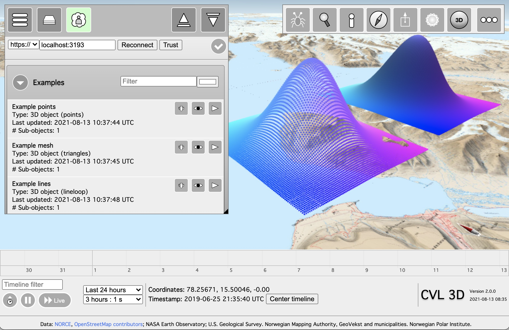

# CVL 3D Visualization

This repository contains the code required for visualizing data on the CVL 3D globe. The repository consists of two components:

- A web server that communicates with both the CVL 3D globe and other clients (typically Python scripts)
- A Python module that handles posting graphical objects to the aforementioned server

## Starting the server

The server is started by executing: `python3 cvl/server.py`. The server listens on port `3193` by default, and expects to find a certificate and private key in the working directory called `cert.pem` and `key.pem`. If you are running the server on your local computer, you can generate a self-signed certificate for localhost by executing the following command:

	openssl req -x509 -nodes -days 730 -newkey rsa:2048 -keyout key.pem -out cert.pem -config cvl/localhost-ssl.conf

If you need to generate a certificate for an IP address or hostname other than `127.0.0.1` and `localhost`, modify the `localhost-ssl.conf` file as appropriate first. Once the certificate has been generated, you must make your web browser trust the certificate. The process to do this varies between operating systems and browsers, but usually involves trying to visit the site serving the certificate, clicking through a number of harshly worded warnings and then trusting the certificate. For a CVL server running on localhost, you can start this process by visiting [https://localhost:3193/trust](https://localhost:3193/trust).

> **Why do I need to do all this certificate-stuff?** Modern browsers restrict loading of resources from "plain" web servers when the original site is loaded securely over TLS, even if the server in question is running on localhost.

### Server options

The server defaults to storing all posted data in memory. Even though you typically access the server from localhost, it is a good idea to consider the memory requirements for the data that you publish to the server, since that translates fairly directly to the memory requirements for the server itself and both bandwidth and memory requirements for the CVL 3D globe visualizing the data.

The server supports the following command line arguments:


## Visualizing data

This repository contains a Jupyter notebook called `notebooks/Examples.ipynb` which demonstrates how to create and post graphical objects to the CVL server. First, open the notebook:

	jupyter notebook notebooks/Examples.ipynb

Next, open the CVL website in a new window: [https://cvl.eo.esa.int](https://cvl.eo.esa.int)

At this point, execute each cell of the Examples notebook in turn, and observe as new elements get added to the visualization in the browser window containing the CVL 3D globe.




Quickstart:

1. Start an instance of the CVL server:
	- `python3 cvl/server.py`
2. Start the Examples notebook
	- ```jupyter notebook notebooks/Examples.ipynb```
3. Open the CVL website: [https://cvl.eo.esa.int](https://cvl.eo.esa.int)
4. Execute each cell of the notebook in turn, and observe as new elements get added to the visualization in the browser tab containing the CVL 3D visualization

